# renmawave-template-xreychecker-redirect-minimal

Шаблончик страницы подписки, который подтягивает статус серверов+протоколы из xrey-checker'a и сопоставляет их с серверами на странице по имени + редиректит ссылки (Возможность использовать собственную или внешнюю страницу переадресации (актуально для Telegram Mini App, например в стиле Orion — [демо](https://github.com/legiz-ru/Orion/blob/main/docs/redirect-page/index.html))

Частично дергал отсюда, доработал визуал+скрипты https://github.com/legiz-ru/Orion

# Установка 
1) Поднимаем Xray-Checker https://github.com/kutovoys/xray-checker
2) Делаем обратное прокси на страницу http://127.0.0.1:2112/metrics

 
       location /metrics {
   
            proxy_pass http://host.docker.internal:2112/metrics;
            proxy_set_header Host $host;
            proxy_set_header X-Real-IP $remote_addr;
            proxy_set_header X-Forwarded-For $proxy_add_x_forwarded_for;
            proxy_set_header X-Forwarded-Proto $scheme;
   
            proxy_connect_timeout 5s;
            proxy_read_timeout 10s;
            proxy_send_timeout 5s;
            proxy_buffering off;

            add_header Access-Control-Allow-Origin *;
            }

4) Из папки с remnawave качаем -

       git clone https://github.com/Fr1ngg/renmawave-template-xreychecker-redirect-minimal.git
   
6) В index.html меняем /metrics на страницу с метрикой, либо /metrics оставить, если панель и xray-chacker подняты на одном сервере

       const res = await fetch('/metrics');

7) подключаем наши файлы + app-config.json в docker-compuse.yml 

       remnawave-subscription-page:
         volumes:
           - ./index.html:/opt/app/frontend/index.html
           - ./app-config.json:/opt/app/frontend/assets/app-config.json
           - ./redirect-page:/opt/app/frontend/redirect-page
   
9) рестартим docker
   
       docker compose down
       docker compose up -d
